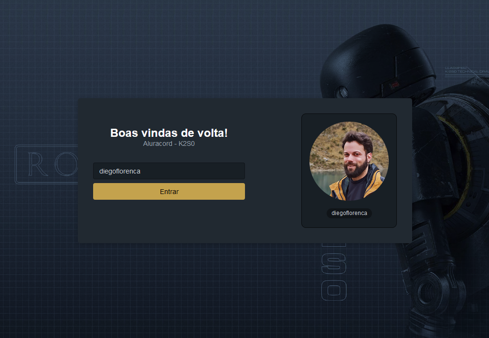

# Event: Imersão React da Alura

[Versão em Português](readme-br.md)

## Aluracord - k2s0

Project developed during the @alura event named 'Imersão React 4' with @omariosouto and @peas. Theme based on android K2S0 from the Star Wars movie Rogue One.




## Technologies

The project is a chat similar to discord, which allows the exchange of messages between two or more participants who register with their GitHub username.

This project has the following technologies:

- [React](https://pt-br.reactjs.org)
- [Next](https://nextjs.org)
- [SkynexUI](https://skynexui.dev)
- [Supabase](http://supabase.com)

## What I have learned?

- This was my first experience with [Next](https://nextjs.org)
- Practice the useEffect adn UseState hooks
- The basic concepts of consuming an API
- I learned how to route pages using next

## Run the project

To run the project you will need [Node.js](https://nodejs.dev) and [Git](https://git-scm.com) on your system. To edit the code I used [VSCode](https://code.visualstudio.com).

1. Clone this repository.

```
git clone https://github.com/diegoflorenca/aluracord-k2s0
```

2. Access the project directory.

3. Install all dependencies using NPM.

```
npm install
```

1. Run the application in development mode.

```
npm run dev
```

## References

This file readme structure was based on [Lário's](https://github.com/lariodiniz) project.

The background image was acquired from [teahub](https://www.teahub.io/).

---

Created by [Diego Florença](https://www.linkedin.com/in/diegoflorenca/)

[](https://www.linkedin.com/in/diegoflorenca/) [](https://codepen.io/diegoflorenca)
